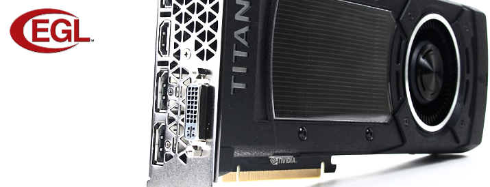

# io-egl

Nim bindings for EGL, the native platform interface for rendering APIs.

## About

TODO

## Supported Platforms

TODO

## Prerequisites

TODO

## Dependencies

io-egl does not have any dependencies to other Nim packages at this time.

## Usage

TODO

## Support

Please [file an issue](https://github.com/nimious/io-egl/issues), submit a
[pull request](https://github.com/nimious/io-egl/pulls?q=is%3Aopen+is%3Apr)
or email us at info@nimio.us if this package is out of date or contains bugs.

## References

* [Khronos EGL Homepage](https://www.khronos.org/egl/)
* [Khronos EGL Registry](https://www.khronos.org/registry/egl/)
* [Nim Programming Language](http://nim-lang.org/)
